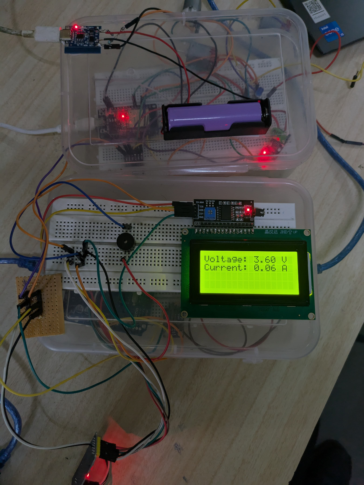
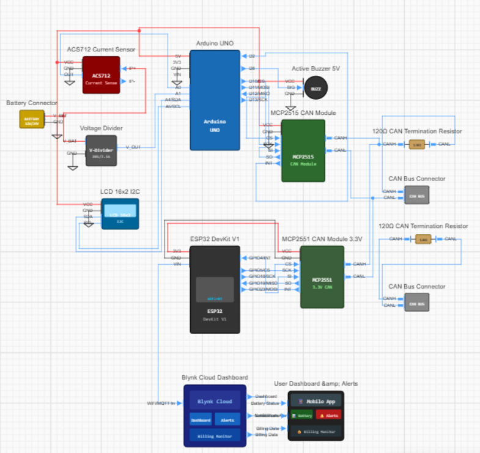
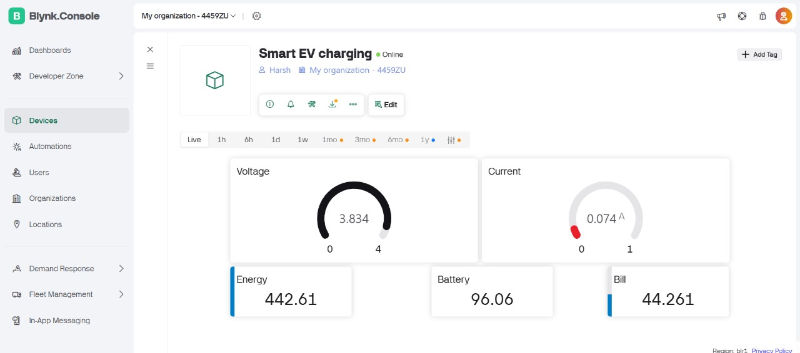
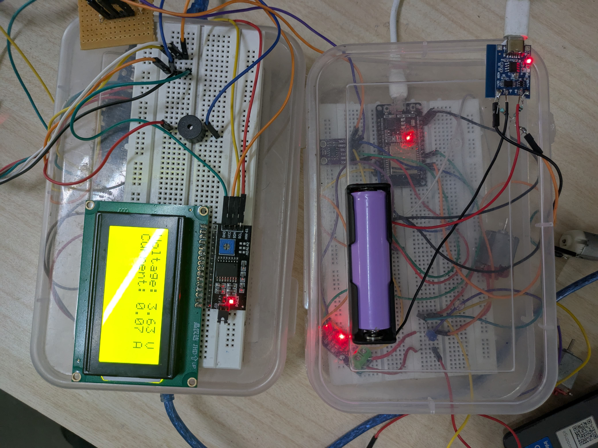
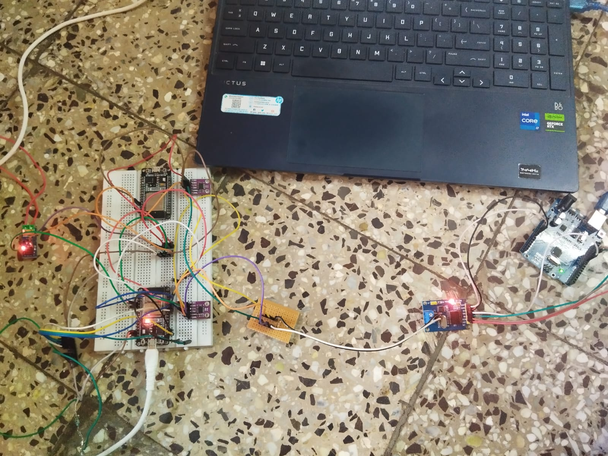

# 🚗 CAN-Based Battery Monitoring System using Arduino UNO, ESP32 and Blynk IoT

An embedded battery monitoring system that demonstrates **Controller Area Network (CAN)** communication between an **Arduino UNO sensor node** and an **ESP32 gateway**. The project integrates **SPI**, **I²C**, **CAN**, and **WiFi** communication protocols to acquire battery parameters, transmit them over a CAN network, and visualize them remotely using the **Blynk IoT Cloud**.

---

# 📖 Problem Statement

Modern battery-powered systems such as electric vehicles, renewable energy storage, and industrial battery banks require reliable real-time monitoring of battery parameters. Traditional standalone monitoring systems cannot efficiently share battery information between distributed embedded nodes or provide remote monitoring capabilities.

This project demonstrates a distributed battery monitoring system where battery parameters are acquired using an Arduino UNO, transmitted over a CAN network, processed by an ESP32 gateway, and uploaded to the cloud for real-time visualization, energy estimation, billing, and alert notifications.

---

# 🎯 Objectives

- Implement Controller Area Network (CAN) communication
- Interface MCP2515 CAN controller using SPI
- Interface 16×2 LCD using I²C
- Acquire battery voltage and current
- Develop modular embedded firmware
- Upload battery data to the cloud
- Estimate battery energy consumption
- Calculate electricity billing
- Generate alert notifications

---

# 📷 Hardware Prototype

<p align="center">

</p>

Complete hardware prototype consisting of an Arduino-based battery monitoring node and an ESP32 gateway communicating through the CAN bus.

---

# 🔌 Hardware Architecture

<p align="center">

</p>

The system consists of two distributed embedded nodes:

### Sender Node (Arduino UNO)

- Reads battery voltage
- Reads battery current
- Displays measurements on LCD
- Packages sensor data into CAN frames
- Transmits CAN messages

### Receiver Node (ESP32)

- Receives CAN frames
- Decodes battery parameters
- Calculates energy consumption
- Calculates electricity bill
- Uploads data to Blynk Cloud
- Generates alert notifications

---
### Battery Specs (18650 Li-ion battery)
-Type: Lithium-ion rechargeable
-Size: 18650
-Nominal Voltage: 3.7 V
-Fully Charged Voltage: 4.2 V
-Discharge Cutoff: Approximately 2.8–3.0 V
-Capacity: Typically 2000–3500 mAh (depends on the specific cell)

# 🔄 Project Workflow

<p align="center">

</p>

```
Battery

↓

Voltage Divider + ACS712

↓

Arduino UNO

↓

SPI

↓

MCP2515 CAN Controller

↓

CAN Bus

↓

MCP2515 CAN Controller

↓

ESP32 Gateway

↓

CAN Frame Decoding

↓

Battery Monitoring

↓

Energy Estimation

↓

Billing

↓

WiFi

↓

Blynk Cloud

↓

Dashboard & Alerts
```

---

# ✨ Features

- Battery Voltage Monitoring
- Current Monitoring using ACS712
- LCD Display (I²C)
- SPI Interface to MCP2515
- CAN 2.0 Communication
- ESP32 Gateway
- WiFi Connectivity
- Blynk Cloud Dashboard
- Battery Percentage Monitoring
- Energy Consumption Estimation
- Electricity Billing
- Mobile Monitoring
- Alert Notifications
- Modular Embedded Firmware

---

# 🔗 Communication Protocols Used

| Protocol | Purpose |
|----------|---------|
| **I²C** | Arduino UNO ↔ LCD Display |
| **SPI** | Arduino UNO ↔ MCP2515 CAN Controller |
| **CAN 2.0** | Arduino UNO ↔ ESP32 Gateway |
| **WiFi** | ESP32 ↔ Blynk Cloud |

---

# 🛠 Key Contributions

During this project I implemented:

- Battery voltage measurement
- Current sensing using ACS712
- I²C communication with LCD
- SPI communication with MCP2515
- CAN frame generation
- CAN frame decoding
- Distributed embedded communication
- ESP32 gateway firmware
- WiFi cloud connectivity
- Blynk dashboard integration
- Energy estimation
- Electricity billing algorithm
- Alert notification mechanism
- Modular embedded software architecture

---

# ⚙️ Hardware Components

| Component | Quantity |
|-----------|---------:|
| Arduino UNO | 1 |
| ESP32 DevKit V1 | 1 |
| MCP2515 CAN Module | 2 |
| ACS712 Current Sensor | 1 |
| Voltage Divider | 1 |
| LCD 16×2 (I²C) | 1 |
| Active Buzzer | 1 |
| Battery | 1 |

---

# 📡 CAN Message Structure

| CAN ID | Description |
|---------|-------------|
| 0x101 | Battery Voltage & Current |
| 0x102 | Battery State of Charge |

---

# 📊 Dashboard

<p align="center">

</p>

The Blynk dashboard displays:

- Battery Voltage
- Battery Current
- Battery Percentage
- Energy Consumption
- Estimated Electricity Bill
- Live Device Status

---

# 📈 Experimental Results

<p align="center">

</p>

The Arduino node continuously measures battery voltage and current, displays the values locally on the LCD, and transmits them over the CAN network. The ESP32 gateway successfully receives, processes, and uploads the data to the Blynk Cloud.

---

# 🧪 Experimental Setup

<p align="center">

</p>

Experimental setup used during firmware development and CAN communication validation.

---

# 🧠 Design Decisions

| Design Choice | Reason |
|---------------|--------|
| Arduino UNO | Dedicated sensor acquisition node |
| ESP32 | CAN gateway with built-in WiFi |
| MCP2515 | External CAN controller |
| SPI | High-speed communication with MCP2515 |
| I²C | Simple interface for LCD |
| CAN Bus | Reliable industrial communication |
| Blynk | Rapid cloud dashboard development |
| Modular Firmware | Easier maintenance and scalability |

---

# ⚠️ Challenges Faced

- Configuring MCP2515 CAN communication
- SPI communication debugging
- LCD integration using I²C
- CAN frame synchronization
- Voltage calibration
- Current sensor calibration
- WiFi reconnection
- Billing algorithm validation
- Cloud synchronization

---

# 📚 Lessons Learned

- Controller Area Network (CAN)
- SPI peripheral communication
- I²C communication
- Distributed embedded systems
- Sensor interfacing
- Embedded debugging
- Battery monitoring techniques
- Cloud integration
- Modular firmware architecture

---

# 💡 Skills Demonstrated

- Embedded C/C++
- Arduino Programming
- ESP32 Development
- SPI Protocol
- I²C Protocol
- CAN 2.0 Protocol
- MCP2515 CAN Controller
- Battery Monitoring
- Sensor Interfacing
- LCD Interfacing
- Energy Metering
- WiFi Networking
- Blynk IoT
- Embedded Debugging
- Modular Firmware Design

---

# 📂 Repository Structure

```text
CAN-Based-Battery-Monitoring-System
│
├── README.md
├── LICENSE
│
├── firmware
│   ├── sender
│   │   └── battery_sensor_node.ino
│   │
│   └── receiver
│       ├── can_gateway_receiver.ino
│       ├── Config.h
│       ├── Billing.cpp
│       ├── Billing.h
│       ├── CANHandler.cpp
│       ├── CANHandler.h
│       ├── BlynkHandler.cpp
│       └── BlynkHandler.h
│
├── images
│   ├── hardware_setup.jpeg
│   ├── circuit_diagram.jpeg
│   ├── software_flow.jpeg
│   ├── dashboard.jpeg
│   ├── result.jpeg
│   └── system_nodes.jpeg
│
└── docs
    └── pin_connections.md
```

---

# ▶️ Build Instructions

1. Upload the sender firmware to the Arduino UNO.
2. Upload the receiver firmware to the ESP32.
3. Connect the MCP2515 modules through the CAN bus.
4. Configure WiFi credentials and the Blynk template.
5. Power both embedded nodes.
6. Observe battery parameters locally on the LCD.
7. Monitor real-time data on the Blynk dashboard.

---

# 🚀 Future Improvements

- CAN FD support
- FreeRTOS implementation
- OTA firmware updates
- MQTT integration
- SD card logging
- Battery health prediction
- BLE gateway
- Multiple battery nodes
- Automotive BMS integration

---


# 👨‍💻 Author

**Parshuram Deshpande**

Electronics & Telecommunication Engineering  
Vishwakarma Institute of Technology, Pune

GitHub: **https://github.com/ParshuramGD**
