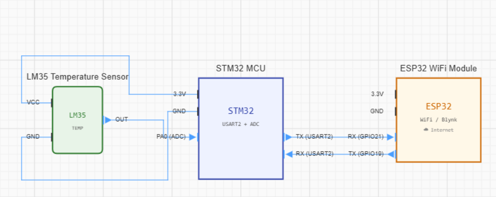
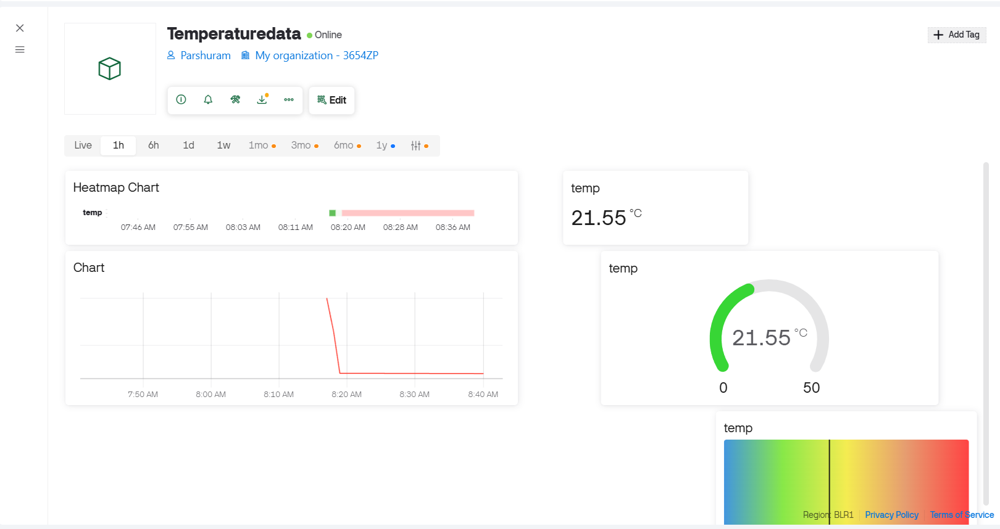
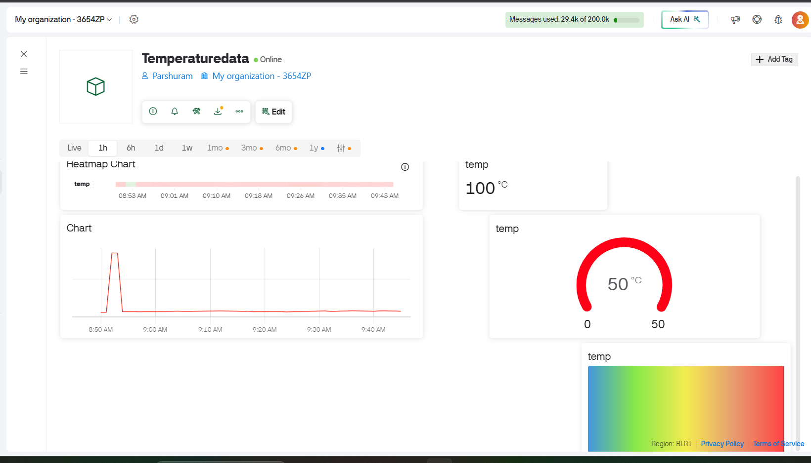
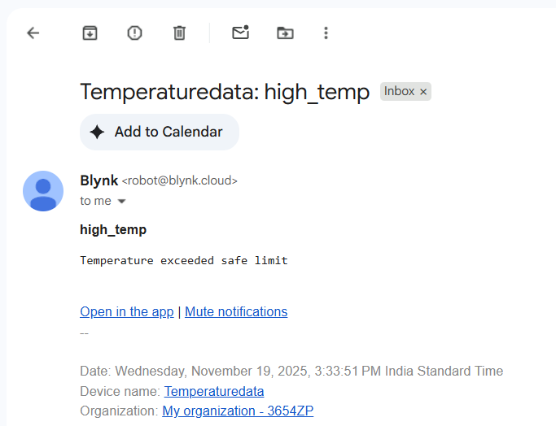

# 🌡️ STM32 + ESP32 IoT Temperature Monitoring System

An IoT-based temperature monitoring system that measures temperature using an LM35 sensor connected to an STM32 microcontroller. The STM32 transmits temperature data via UART to an ESP32, which uploads the data to the Blynk Cloud for real-time monitoring and threshold-based email notifications.

---

## 📷 Project Interface

This is the complete hardware setup used for the project.

<p align="center">
  
</p>

---

# System Architecture

The following block diagram illustrates communication between the LM35 sensor, STM32, ESP32, and Blynk Cloud.

<p align="center">
  
</p>

---

# Hardware Circuit

The circuit connections between LM35, STM32 and ESP32 are shown below.

<p align="center">
  
</p>

---

# System Workflow

The complete data flow from sensing temperature to cloud monitoring.

<p align="center">
  
</p>

---

# Features

- LM35 Analog Temperature Sensor
- STM32 ADC Temperature Acquisition
- UART Communication (115200 baud)
- ESP32 WiFi Gateway
- Blynk IoT Cloud Integration
- Real-time Dashboard
- Gauge, Graph and Heatmap Widgets
- Email Alerts
- High Temperature Notifications

---

# Hardware Used

| Component | Quantity |
|-----------|---------|
| STM32 Development Board | 1 |
| ESP32 DevKit | 1 |
| LM35 Temperature Sensor | 1 |
| Breadboard | 1 |
| Jumper Wires | Several |
| USB Cable | 2 |

---

# Software Used

- STM32CubeIDE
- Arduino IDE
- Blynk IoT Platform
- STM32 HAL Drivers

---

# Communication Flow

LM35
↓ Analog Voltage

STM32 ADC
↓ Convert to Temperature

UART (115200)
↓ Serial Communication

ESP32
↓ WiFi

Blynk Cloud
↓ Internet

Mobile Dashboard
↓
Email Alerts

---

# Dashboard

Real-time monitoring dashboard built using Blynk IoT.

<p align="center">
  
</p>

Dashboard includes:

- Live Temperature
- Gauge Widget
- Heatmap
- Historical Graph
- Color Indicator

---

# High Temperature Detection

When temperature crosses the configured threshold, the dashboard immediately reflects the alarm condition.

<p align="center">
  
</p>

---

# Email Notification

The Blynk Cloud automatically sends an email notification whenever the temperature exceeds the safe operating limit.

<p align="center">
  
</p>

---

# Repository Structure

```
.
├── README.md
├── images
│   ├── interface.png
│   ├── diagram.png
│   ├── circuit_diagram.png
│   ├── design_flow.png
│   ├── dashboard.png
│   ├── alert_dashboard.png
│   ├── alert_email.png
│
├── stm32
│   ├── Core
│   ├── Drivers
│   └── STM32CubeIDE Project
│
├── esp32
│   └── esp32_code_uart.c
│
└── LICENSE
```

---

# Future Improvements

- OLED Display
- MQTT Support
- Firebase Integration
- SD Card Data Logging
- Multiple Temperature Sensors
- FreeRTOS-based Firmware
- OTA Updates for ESP32

---

# Author

**Parshuram Deshpande**

Electronics & Telecommunication Engineering

Vishwakarma Institute of Technology, Pune
