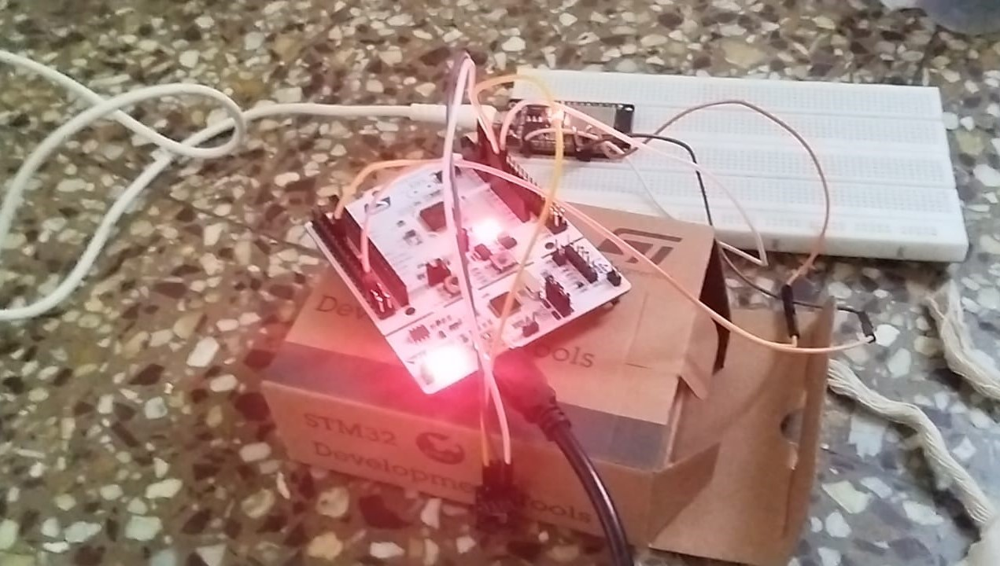
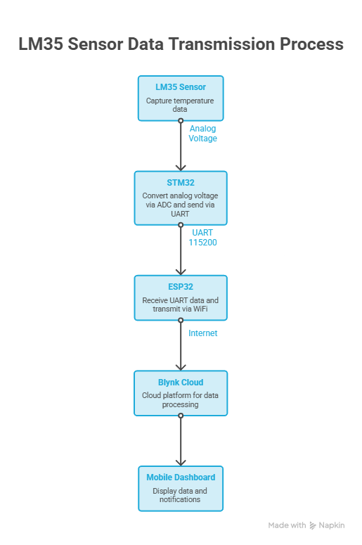

# 🌡️ Real-Time Temperature Monitoring System using STM32, ESP32, UART and Blynk IoT

An embedded IoT temperature monitoring system that acquires analog temperature data using an **LM35 sensor** connected to an **STM32 microcontroller**, transmits the measurements over **UART** to an **ESP32**, and uploads the data to the **Blynk IoT Cloud** for real-time visualization and threshold-based email notifications.

---

## 📖 Project Overview

Industrial equipment and electronic systems often require continuous temperature monitoring to prevent overheating and ensure reliable operation. Local monitoring solutions provide limited accessibility and cannot notify users remotely.

This project demonstrates a modular embedded system where:

- STM32 performs sensor acquisition and ADC conversion.
- ESP32 acts as a WiFi gateway.
- Blynk Cloud provides remote visualization.
- Automatic email alerts are generated when the temperature exceeds configured limits.

The project demonstrates the complete embedded workflow from **sensor interfacing → firmware development → communication protocol → cloud connectivity**.

---

# 📷 Hardware Prototype

<p align="center">

</p>

Prototype assembled using an STM32 development board, ESP32 DevKit, LM35 sensor, and breadboard.

# 🔌 Hardware Circuit

<p align="center">

</p>

---

# 🔄 System Workflow

<p align="center">

</p>

The complete data flow consists of:

1. LM35 generates an analog voltage proportional to temperature.
2. STM32 samples the voltage using its 12-bit ADC.
3. Temperature is transmitted over UART (115200 baud).
4. ESP32 receives and parses the UART stream.
5. ESP32 uploads temperature to Blynk Cloud.
6. Dashboard updates in real time.
7. Email alerts are generated if configured thresholds are exceeded.

---

# ✨ Key Features

- Real-time temperature monitoring
- Analog sensor interfacing using LM35
- STM32 ADC acquisition
- UART communication at 115200 baud
- ESP32 WiFi gateway
- Blynk Cloud integration
- Live dashboard visualization
- Historical graph
- Gauge widget
- Heatmap visualization
- Threshold-based email notifications

---

# 🛠️ Key Contributions

During this project I implemented:

- Configured STM32 ADC for analog temperature acquisition
- Implemented UART communication between STM32F446RE and ESP32
- Developed UART data parsing on ESP32
- Integrated ESP32 with WiFi and Blynk IoT Cloud
- Implemented threshold-based event notifications
- Debugged serial communication and data parsing
- Validated end-to-end sensor-to-cloud communication

---

# ⚙️ Hardware Components

| Component | Quantity |
|------------|----------|
| STM32 Development Board | 1 |
| ESP32 DevKit | 1 |
| LM35 Temperature Sensor | 1 |
| Breadboard | 1 |
| Jumper Wires | Several |
| USB Cable | 2 |

---

# 📌 Pin Connections

| Device | Pin | Connected To |
|---------|-----|--------------|
| LM35 | OUT | STM32 PA0 (ADC) |
| LM35 | VCC | 3.3V |
| LM35 | GND | GND |
| STM32 USART2 TX | ESP32 GPIO21 (RX) |
| STM32 USART2 RX | ESP32 GPIO19 (TX) |
| STM32 GND | ESP32 GND |

---

# 🌡️ Sensor Specifications

### LM35 Temperature Sensor

| Parameter | Specification |
|-----------|---------------|
| Sensor Type | Analog Temperature Sensor |
| Operating Voltage | 4 V – 30 V DC |
| Temperature Range | −55°C to +150°C |
| Accuracy | ±0.5°C (Typical @ 25°C) |
| Sensitivity | 10 mV/°C |
| Output Type | Analog Voltage |
| Current Consumption | < 60 µA |
| Self-Heating | < 0.1°C in Still Air |
| Interface | Analog ADC Input |

**Working Principle**

The LM35 produces an output voltage linearly proportional to temperature at a scale factor of **10 mV/°C**. The STM32 ADC samples this analog voltage, converts it into a digital value, and the firmware calculates the corresponding temperature before transmitting it to the ESP32 over UART.

Temperature calculation used in the firmware:

```cpp
float voltage = adcValue * (3.3 / 4095.0);      // STM32 12-bit ADC
float temperature = voltage * 100.0;
```
# 💻 Software Stack

- Embedded C
- STM32 HAL
- STM32CubeIDE
- Arduino IDE
- ESP32 Arduino Framework
- Blynk IoT Platform

---

# 📊 Dashboard

<p align="center">

</p>

The dashboard displays:

- Live temperature
- Analog gauge
- Historical graph
- Heatmap
- Numeric display
- Color indicator

---

# 🚨 Threshold Detection

<p align="center">

</p>

When the configured temperature threshold is exceeded:

- Dashboard updates immediately
- Event notification is triggered
- Alert is forwarded to Blynk Cloud

---

# 📧 Email Notification

<p align="center">

</p>

Blynk automatically sends an email notification when the configured threshold is exceeded.

---

# 🧠 Design Decisions

| Design Choice | Reason |
|---------------|--------|
| STM32 | Accurate ADC and mature HAL ecosystem |
| ESP32 | Built-in WiFi and cloud connectivity |
| UART | Simple, reliable point-to-point communication |
| LM35 | Linear analog output with minimal external circuitry |
| Blynk | Rapid IoT dashboard development |

---

# ⚠️ Challenges Faced

- UART data synchronization
- Reliable serial parsing
- Temperature calibration
- WiFi reconnection handling
- Configuring cloud events
- Threshold tuning for notifications

---

# 📚 Lessons Learned

- ADC configuration on STM32
- Analog sensor interfacing
- UART framing and debugging
- Serial data parsing
- Cloud integration using ESP32
- Event-driven firmware design
- End-to-end embedded system validation

---

# 🛠 Skills Demonstrated

- Embedded C
- STM32 HAL
- STM32 ADC
- UART Communication
- ESP32 Development
- WiFi Networking
- Sensor Interfacing
- Serial Debugging
- IoT Systems
- Cloud Integration
- Firmware Development

---

# 📂 Repository Structure

```
Embedded-System-Projects/
│
├── README.md
│
├── firmware/
│   ├── stm32/
│   │   └── stm32_code_temp.c
│   │
│   └── esp32/
│       └── esp32_code_uart.c
│
├── images/
│   ├── interface.png
│   ├── circuit_diagram.png
│   ├── design_flow.png
│   ├── dashboard.png
│   ├── alert_dashboard.png
│   └── alert_email.png
│
└── LICENSE
```

---

# ▶️ How to Run

1. Flash the STM32 firmware using STM32CubeIDE.
2. Upload the ESP32 firmware using Arduino IDE.
3. Configure WiFi credentials and Blynk Template.
4. Connect the hardware according to the circuit diagram.
5. Open the Blynk dashboard.
6. Observe live temperature updates and trigger alerts by exceeding the configured threshold.

---

# 🚀 Future Improvements

- FreeRTOS implementation
- DMA-based UART communication
- MQTT integration
- Firebase support
- SD card data logging
- Low-power operating mode
- BLE gateway support
- OTA firmware updates
- Multiple sensor nodes


# 👨‍💻 Author

**Parshuram Deshpande**

Electronics & Telecommunication Engineering  
Vishwakarma Institute of Technology, Pune

GitHub: https://github.com/ParshuramGD
